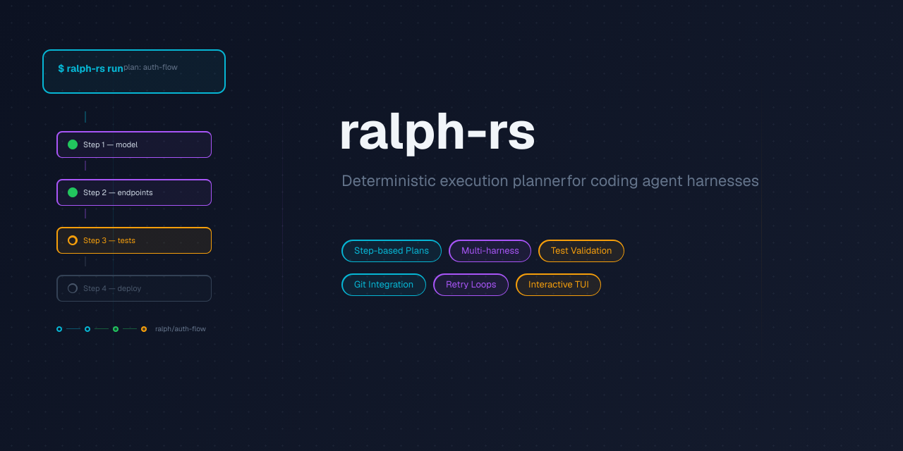

<p align="center"></p>

# ralph-rs

A deterministic orchestrator for coding agent harnesses. Takes step-based plans and executes them through AI coding agents (Claude, Codex, OpenCode, Copilot, Goose, Pi) with retry loops, test validation, and git integration.

## What it does

- **Plan management**: Create, edit, and execute step-based plans for AI coding agents
- **Multi-harness support**: Works with Claude Code, Codex, OpenCode, Copilot, Goose, Pi, and more
- **Deterministic execution**: Subprocess orchestration with test validation, git commits, and rollback on failure
- **Retry with context**: Failed attempts inject diffs and test output into retry prompts
- **Plan portability**: Export/import plans as JSON for harness comparison and reuse

## Install

```bash
curl -fsSL https://raw.githubusercontent.com/christopher-kapic/ralph-rs/master/scripts/install.sh | bash
```

To install a specific version or to a custom directory:

```bash
# Specific version
curl -fsSL https://raw.githubusercontent.com/christopher-kapic/ralph-rs/master/scripts/install.sh | bash -s v0.2.0

# Custom directory
curl -fsSL https://raw.githubusercontent.com/christopher-kapic/ralph-rs/master/scripts/install.sh | INSTALL_DIR=~/.local/bin bash
```

Or build from source:

```bash
cargo install --path .
```

## Quick Start

```bash
# Initialize config and database
ralph init

# Create a plan
ralph plan create auth --description "Add user authentication" --test "cargo build" --test "cargo test"

# Add steps (first positional is the step title, second is the plan slug)
ralph step add "Add user model" auth --description "Create User struct with id, email, password_hash fields" --criteria "User struct exists in src/models/user.rs" --criteria "Tests pass"
ralph step add "Add API endpoints" auth --description "Create login/register endpoints" --criteria "/api/login returns 200 with valid credentials"

# Approve and run
ralph plan approve auth
ralph run auth
```

## Usage

### Plan Management

```bash
ralph plan create <slug>               # Create a new plan
  [--description <d>]                     #   Plan description (also -d)
  [--test <cmd>]...                       #   Repeatable: deterministic test commands
  [--harness <h>]                         #   Plan-level harness override
  [--agent <name>]                        #   Plan-level agent definition
  [--branch <name>]                       #   Custom branch name
  [--depends-on <slug>]...                #   Plan-level dependencies

ralph plan list [--all] [--status <s>] [--archived]   # List plans
ralph plan show <slug>                 # Show plan details
ralph plan approve <slug>              # Approve plan (planning -> ready)
ralph plan delete <slug>               # Delete a plan
ralph plan archive <slug>              # Archive a completed/failed plan
```

### Step Management

```bash
ralph step list [<slug>]               # List steps in a plan (defaults to active plan)
ralph step add <title> [<slug>]        # Add a step (title is positional)
  [--description <d>]                     #   Step description (also -d)
  [--criteria <c>]...                     #   Acceptance criteria
  [--agent <name>]                        #   Step-level agent override
  [--after <num>]                         #   Insert after step number
  [--import-json <FILE|->]                #   Bulk-insert from JSON (array or object)

ralph step remove <num> [<slug>]       # Remove step by position
ralph step edit <num> [<slug>]         # Edit step fields (--title/--description)
ralph step reset <num> [<slug>]        # Reset step to pending
ralph step move <num> [<slug>] --to <n># Reorder step
```

### Execution

```bash
ralph run [<slug>]                     # Run all pending steps in a plan
ralph run [<slug>] --one               # Run only the next pending step
ralph run --all                        # Run every plan in dependency order
ralph run [<slug>] --from <n> --to <m> # Run a specific step range
ralph run [<slug>] --dry-run           # Print what would happen without executing
ralph run [<slug>] --current-branch    # Run on current branch (skip branch creation)
ralph run [<slug>] --harness <h>       # Override harness for this run
ralph resume [<slug>]                  # Resume from last failed step
ralph skip [<slug>]                    # Skip failed step, continue
```

### Planning with a Harness

```bash
ralph plan harness generate <description>        # Delegate planning to an AI harness
ralph plan harness set <harness> [<slug>]        # Set the plan-generation harness
ralph plan harness show [<slug>]                 # Show the current harness for a plan
```

### Portability

```bash
ralph export <slug> [-o <file>]        # Export plan to JSON
ralph import <file>                    # Import plan from JSON
  [--slug <name>]                         #   Override the plan slug on import
  [--branch <name>]                       #   Override the branch name on import
```

### Utilities

```bash
ralph status [<slug>] [--verbose]      # Show execution status
ralph log [<slug>] [--step <n>] [--limit <n>] [--full|--lines <n>]   # Show execution logs
ralph agents <list|show|create|delete> # Manage agent file templates
ralph doctor                           # Check config, DB, harness availability
```

## Harness Comparison

Export a plan and run it with different harnesses to compare results:

```bash
# Create and export a plan
ralph plan harness generate "Add user auth"
ralph export auth -o auth.json

# Import into each project copy (import writes to the DB scoped to the current cwd;
# use --slug to give each copy a distinct name if they share a database)
cd ~/myapp-claude && ralph import ~/auth.json --slug auth-claude
cd ~/myapp-codex  && ralph import ~/auth.json --slug auth-codex

# Run each copy with a different harness
cd ~/myapp-claude && ralph run auth-claude --harness claude &
cd ~/myapp-codex  && ralph run auth-codex  --harness codex  &
```

## Configuration

Config lives at `~/.config/ralph-rs/config.json` (Linux/macOS) with harness definitions, default harness, retry settings, and timeout configuration.

Agent definitions are markdown files in `~/.config/ralph-rs/agents/*.md`.

## Lifecycle Hooks

Ralph supports shell-based lifecycle hooks at four points during step execution: `pre-step`, `post-step`, `pre-test`, and `post-test`. Hooks are defined once in a reusable library at `~/.config/ralph-rs/hooks/*.md` (nothing in your working directory) and then attached to plans or individual steps via CLI:

```bash
ralph hooks add my-review --lifecycle post-step --command "claude -p 'review this'"
ralph plan set-hook my-feature --lifecycle post-step --hook my-review       # every step
ralph step set-hook 3 --plan my-feature --lifecycle post-step --hook my-review  # one step
ralph hooks export -o bundle.json        # share with teammates
ralph hooks import bundle.json
```

Hooks can be `global` or path-scoped to specific project prefixes. When you run `ralph plan harness generate`, the plan agent is told which hooks are available and can attach them to steps it thinks deserve review.

For the full model (library layout, scope rules, sharing, worked examples for Claude Code / Codex / clippy), see [docs/review-hooks.md](docs/review-hooks.md).

## License

MIT
