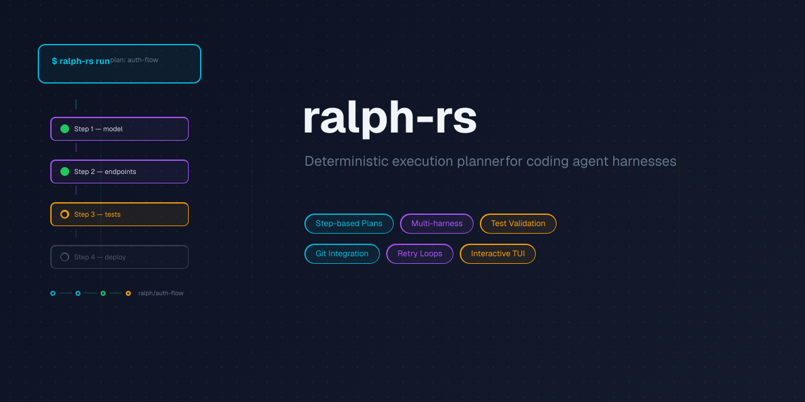

<p align="center"></p>

# ralph-rs

An orchestrator for coding agent harnesses built on **deterministic dependencies & validation, dynamic scheduling, and optional nondeterministic review**. Takes plans whose steps form a dependency DAG and executes them through AI coding agents (Claude, Codex, OpenCode, Copilot, Goose, Pi) with retry loops, test validation, git integration, and an optional built-in step-by-step review pipeline.

ralph's reproducibility promise is **per-step**, not whole-run: given the same inputs a step behaves the same way, and the scheduler's choice among runnable steps is a deterministic `(topological depth, sort_key, short_id)` tie-break — so a linear plan (and any plan, given identical human answers) executes in the same order it always did. What is *new* is **dynamic scheduling** (when a branch blocks on a human, the order the remaining branches run in depends on when the human answers) and **first-class nondeterministic review** (a separate harness can audit each step). The wall-clock interleave of concurrently-running reviews is explicitly **not** part of the reproducibility guarantee.

## What it does

- **Dependency-DAG plans**: Steps declare dependencies; independent branches run while another is blocked on a human
- **Multi-harness support**: Works with Claude Code, Codex, OpenCode, Copilot, Goose, Pi, and more
- **Deterministic dependencies & validation**: Test-gated steps, git commits, and rollback on failure; per-step behavior and the `(topological depth, sort_key, short_id)` scheduling tie-break are deterministic
- **Dynamic scheduling**: A single scheduler picks the next runnable step; when a branch blocks on a human, unrelated branches keep moving and the human batch-answers on their own schedule
- **Optional nondeterministic review**: A built-in step-by-step review pipeline can audit each step with a second harness (off by default; per-step/plan/global toggle)
- **Retry with context**: Failed attempts inject diffs and test output into retry prompts
- **Plan portability**: Export/import plans (including the DAG edges) as JSON for harness comparison and reuse

## Install

**Requirements:** git >= 2.23 (uses `git restore`).

```bash
curl -fsSL https://raw.githubusercontent.com/christopher-kapic/ralph-rs/master/scripts/install.sh | bash
```

To install a specific version or to a custom directory:

```bash
# Specific version
curl -fsSL https://raw.githubusercontent.com/christopher-kapic/ralph-rs/master/scripts/install.sh | bash -s v0.2.0

# Custom directory
curl -fsSL https://raw.githubusercontent.com/christopher-kapic/ralph-rs/master/scripts/install.sh | INSTALL_DIR=~/.local/bin bash
```

Or build from source:

```bash
cargo install --path .
```

## Quick Start

```bash
# Initialize config and database
ralph init

# Create a plan
ralph plan create auth --description "Add user authentication" --test "cargo build" --test "cargo test"

# Add steps (first positional is the step title, second is the plan slug)
ralph step add "Add user model" auth --description "Create User struct with id, email, password_hash fields" --criteria "User struct exists in src/models/user.rs" --criteria "Tests pass"
ralph step add "Add API endpoints" auth --description "Create login/register endpoints" --criteria "/api/login returns 200 with valid credentials"

# Approve and run
ralph plan approve auth
ralph run auth
```

## Usage

### Plan Management

```bash
ralph plan create <slug>               # Create a new plan
  [--description <d>]                     #   Plan description (also -d)
  [--test <cmd>]...                       #   Repeatable: deterministic test commands
  [--harness <h>]                         #   Plan-level harness override
  [--agent <name>]                        #   Plan-level agent definition
  [--branch <name>]                       #   Custom branch name
  [--depends-on <slug>]...                #   Plan-level dependencies

ralph plan list [--all] [--status <s>] [--archived]   # List plans
ralph plan show <slug>                 # Show plan details
ralph plan approve <slug>              # Approve plan (planning -> ready)
ralph plan delete <slug>               # Delete a plan
ralph plan archive <slug>              # Archive a completed/failed plan
```

### Step Management

```bash
ralph step list [<slug>]               # List steps in a plan (defaults to active plan)
ralph step add <title> [<slug>]        # Add a step (title is positional)
  [--description <d>]                     #   Step description (also -d)
  [--criteria <c>]...                     #   Acceptance criteria
  [--agent <name>]                        #   Step-level agent override
  [--after <num>]                         #   Insert after step number
  [--import-json <FILE|->]                #   Bulk-insert from JSON (array or object)

ralph step remove <num> [<slug>]       # Remove step by position
ralph step edit <num> [<slug>]         # Edit step fields (--title/--description)
ralph step reset <num> [<slug>]        # Reset step to pending
ralph step move <num> [<slug>] --to <n># Reorder step
```

### Execution

```bash
ralph run [<slug>]                     # Run all pending steps in a plan
ralph run [<slug>] --one               # Run only the next pending step
ralph run --all                        # Run every plan in dependency order
ralph run [<slug>] --from <n> --to <m> # Run a specific step range
ralph run [<slug>] --dry-run           # Print what would happen without executing
ralph run [<slug>] --current-branch    # Run on current branch (skip branch creation)
ralph run [<slug>] --auto-stash        # Auto-commit a dirty tree instead of bailing
ralph run [<slug>] --harness <h>       # Override harness for this run (beats the global --harness)
ralph resume [<slug>]                  # Resume from last failed step
ralph skip [<slug>]                    # Skip failed step, continue
```

### Planning with a Harness

```bash
ralph plan harness generate <description>        # Delegate planning to an AI harness
ralph plan harness set <harness> [<slug>]        # Set the plan-generation harness
ralph plan harness show [<slug>]                 # Show the current harness for a plan
```

### Portability

```bash
ralph export <slug> [-o <file>]        # Export plan to JSON
ralph import <file>                    # Import plan from JSON
  [--slug <name>]                         #   Override the plan slug on import
  [--branch <name>]                       #   Override the branch name on import
```

### Utilities

```bash
ralph status [<slug>] [--verbose]      # Show execution status
ralph log [<slug>] [--step <n>] [--limit <n>] [--full|--lines <n>]   # Show execution logs
ralph agents <list|show|create|delete> # Manage agent file templates
ralph doctor                           # Check config, DB, harness availability
```

## Harness Comparison

Export a plan and run it with different harnesses to compare results:

```bash
# Create and export a plan
ralph plan harness generate "Add user auth"
ralph export auth -o auth.json

# Import into each project copy (import writes to the DB scoped to the current cwd;
# use --slug to give each copy a distinct name if they share a database)
cd ~/myapp-claude && ralph import ~/auth.json --slug auth-claude
cd ~/myapp-codex  && ralph import ~/auth.json --slug auth-codex

# Run each copy with a different harness
cd ~/myapp-claude && ralph run auth-claude --harness claude &
cd ~/myapp-codex  && ralph run auth-codex  --harness codex  &
```

## Configuration

Config lives at `~/.config/ralph-rs/config.json` (Linux/macOS) with harness definitions, default harness, retry settings, and timeout configuration.

Relevant top-level keys:

- `default_harness` — harness used when none is specified (must match a key under `harnesses`).
- `max_retries_per_step` — retry budget per step (default: 3).
- `timeout_secs` — harness invocation timeout in seconds. `null`, omitting the field, or the legacy value `0` all disable the timeout (default: disabled).
- `hook_timeout_secs` — lifecycle hook timeout (`0` disables; default: 120).
- `auto_stash` — when `true`, `ralph run` auto-commits a dirty working tree before switching to the plan branch. When `false` (default) `ralph run` lists the dirty files and bails so you can stage or discard them intentionally; pass `--auto-stash` to override for a single run.

Agent definitions are markdown files in `~/.config/ralph-rs/agents/*.md`.

## Lifecycle Hooks

Ralph supports shell-based lifecycle hooks at four points during step execution: `pre-step`, `post-step`, `pre-test`, and `post-test`. Hooks are defined once in a reusable library at `~/.config/ralph-rs/hooks/*.md` (nothing in your working directory) and then attached to plans or individual steps via CLI:

```bash
ralph hooks add my-review --lifecycle post-step --command "claude -p 'review this'"
ralph plan set-hook my-feature --lifecycle post-step --hook my-review       # every step
ralph step set-hook 3 --plan my-feature --lifecycle post-step --hook my-review  # one step
ralph hooks export -o bundle.json        # share with teammates
ralph hooks import bundle.json
```

Hooks can be `global` or path-scoped to specific project prefixes. When you run `ralph plan harness generate`, the plan agent is told which hooks are available and can attach them to steps it thinks deserve review.

Each hook runs with a wall-clock budget controlled by `hook_timeout_secs` in `config.json` (default: 120; set to `0` to disable). A hook that exceeds the budget is killed and its step attempt is marked failed.

For the full model (library layout, scope rules, sharing, worked examples for Claude Code / Codex / clippy), see [docs/review-hooks.md](docs/review-hooks.md).

## Interactive TUI

Running `ralph` with no subcommand drops into a vim-flavored TUI modeled
on lazygit. From here you can navigate plans, edit prompts, run plans,
and answer questions raised by the harness without leaving the terminal.

```bash
ralph             # plan list (landing screen)
ralph run         # plan detail of the active plan, auto-starting the run
ralph run <slug>  # plan detail of <slug>, auto-starting the run
```

The TUI is **opt-in** — passing any non-default flag to `ralph run`
(e.g., `--one`, `--all`, `--harness`, `--json`) keeps today's
non-interactive behavior so scripts don't regress. The
`--non-interactive` flag forces the same path from a TTY for cases like
`ralph run | tee log.txt`.

### Views

The TUI is multi-view, with `?` opening a help overlay listing the
bindings of the current view at any time:

| View              | Entered by                                    | What it does                                  |
|-------------------|-----------------------------------------------|-----------------------------------------------|
| Plan list         | `ralph`                                        | Landing screen; tile per plan, sort by recency |
| Archived list     | `enter` on the "Archived (N)" tile             | Same layout as plan list; `enter` unarchives, `d` permanently deletes |
| Plan detail       | `enter` on a plan tile, or `ralph run`         | Step list + right-pane summary or live run tails |
| Step detail       | `enter` on a step in plan detail               | Stacked editable prompt panes (`c` opens `$EDITOR`) |
| Sub-views         | `D` (deps), palette `/plan set-hook`, etc.     | Plan dependencies, plan hooks, step hooks, step tags |

### Common keybindings

The full list lives behind `?` in each view; this is the cheat sheet.

| Action                                  | Plan list      | Archived  | Plan detail        | Step detail   |
|-----------------------------------------|----------------|-----------|--------------------|---------------|
| Navigate                                | `j` / `k`      | `j` / `k` | `j` / `k`          | `j` / `k` (panes) |
| Open / drill in                         | `enter` / `l`  | (unarchive) | `enter` / `l`    | (focus pane)  |
| Pop view                                | `q`            | `q` / `h` | `q` / `h`          | `q` / `h`     |
| Multi-select                            | `space`        | `space`   | `space`            | —             |
| Create                                  | `i` / `a`      | —         | `i` (above) / `a` (below) | — (palette: `/step add`) |
| Delete                                  | `d` (archive)  | `d` (delete) | `d`             | —             |
| Approve plan                            | `A`            | —         | (palette `/plan approve`) | —      |
| Run / resume                            | (palette `/run`) | —       | `R`                | —             |
| Stop the live run                       | —              | —         | `S`                | —             |
| Skip running step                       | —              | —         | `s`                | —             |
| Edit pane in `$EDITOR`                  | —              | —         | —                  | `c`           |
| Answer open question                    | —              | —         | `A`                | `a` on questions pane |
| Move step                               | —              | —         | `Shift-J`/`Shift-K` | —            |
| Reset step                              | —              | —         | `r`                | —             |
| Plan dependencies                       | —              | —         | `D`                | —             |
| Help overlay                            | `?`            | `?`       | `?`                | `?`           |
| Command palette                         | `/` or `:`     | `/` or `:` | `/` or `:`        | `/` or `:`    |

### Command palette

Pressing `/` or `:` opens an inline palette like in lazygit. Tab cycles
candidates; `enter` runs:

```
/run [<branch>]
/plan harness [<name>]
/plan show|archive|unarchive|delete|approve|questions on|off [<slug>]
/plan dependency add|remove|list
/plan set-hook|unset-hook|hooks
/step add <title>
/step skip [<num>]
/step move <num> --to <m>
/step set-hook|unset-hook|edit --tags
/cancel
/export <slug> [-o <path>]
/import <path>
/quit
/help
```

### Live runs and questions

When the TUI spawns the runner subprocess, the right pane streams
NDJSON events from the runner: harness stdout/stderr, test output,
phase transitions, and the final summary. See
[docs/ndjson-events.md](docs/ndjson-events.md) for the event schema —
the same stream is what `--json` / `--jsonl` emit on stdout.

The harness can pause the run at any time with `ralph question ask
"..."` (or `ralph block "..."`). The TUI surfaces a `❓` indicator on the
step, opens an answer modal on `A` or `a`, and offers to resume the
implementation once the last open question is answered.

For the full UX spec, see [TUI-plan.md](TUI-plan.md).

## License

MIT
